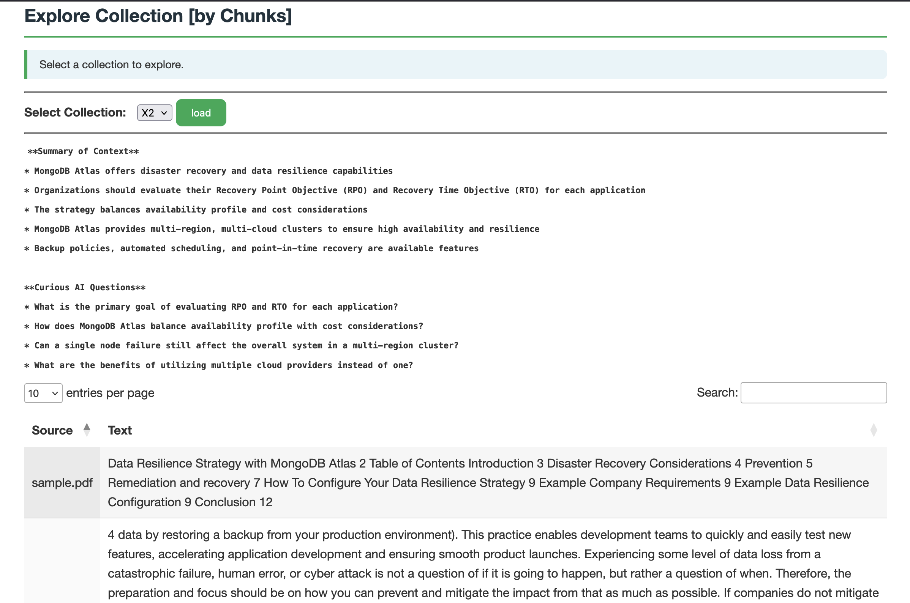
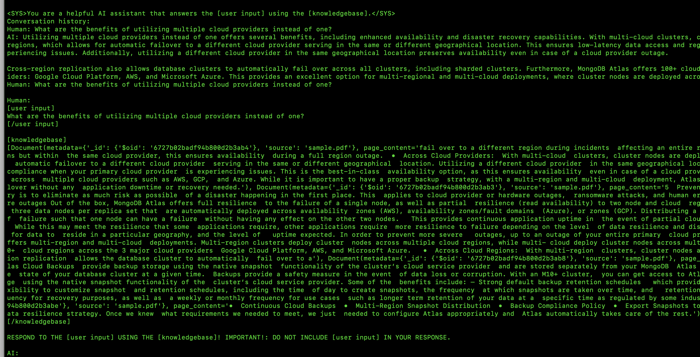
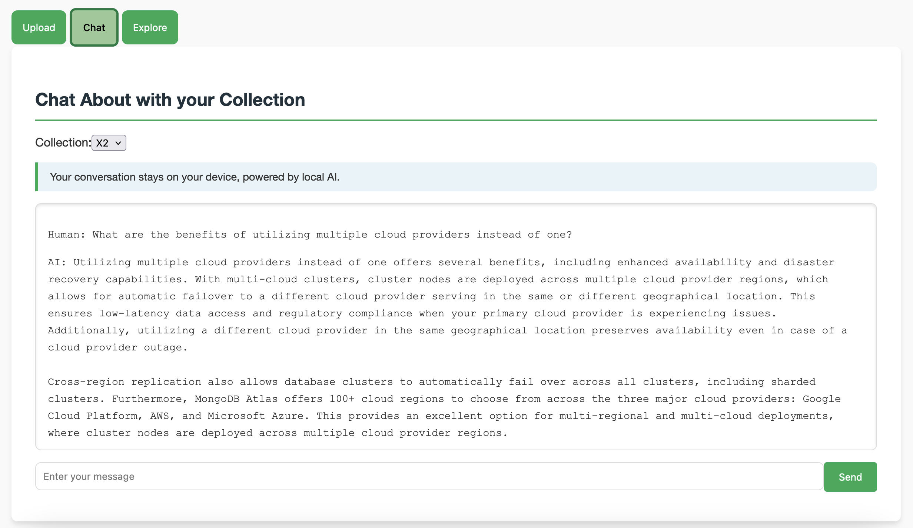
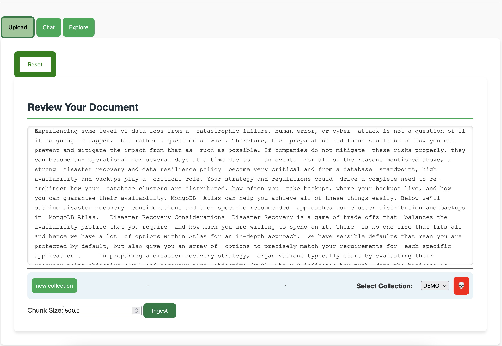
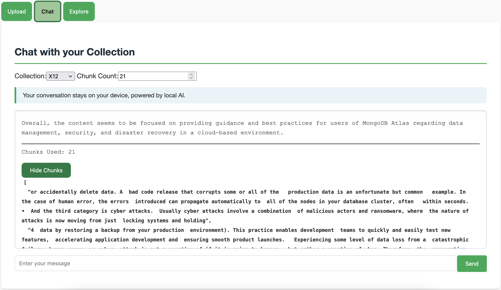
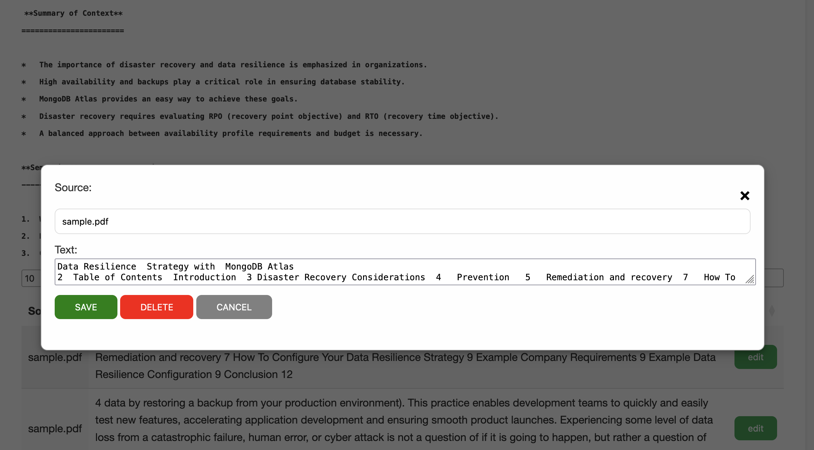

# Chat-with-Collection-of-Notes | Powered by MongoDB

_Inspired by https://github.com/fivestarspicy/chat-with-notes_


Chat-with-Notes is a simple web application built with Flask that allows users to upload text files, display their content, and interact with an AI chatbot to discuss the content. The application uses a locally running Ollama Llama 3.2 model for AI responses, ensuring privacy and data security. 

# MongoDB Atlas

Build Collections of notes that you can chat with, all powered by MongoDB Atlas Vector Search.

## Features

- Chunk Management (View/Edit/Delete)
- Chat Chunk Control (How many chunks to use)
- Ingest Chunk Size Control (How big should the chunks be @ ingest)
- Upload and display files
- Multiple File Formats Supported (PDF, .txt, .md, .html, etc)
- Chat with an AI about the uploaded content
- Privacy-focused: all processing happens locally - NOTHING LEAVES YOUR DEVICE!
- Ability to upload new files mid-conversation
- Clear chat history or all data as needed

## Prerequisites

- Python 3.x
- pip (Python package installer)
- Git
- Ollama with Llama 3.2 model running locally

## Installation

1. **Clone the Repository**

   ```
   git clone git@github.com:ranfysvalle02/chat-with-docs-mdb.git
   cd chat-with-docs-mdb
   ```

2. **Create and Activate Virtual Environment**

   ```
   python3 -m venv chat-with-notes-mdb-env
   source chat-with-notes-mdb-env/bin/activate  # On Windows, use `chat-with-notes-mdb-env\Scripts\activate`
   ```

3. **Install Dependencies**

   ```
   pip3 install -r requirements.txt
   ```

4. **Set Up and Run Ollama Llama 3.2 Model**

   Make sure you have the Ollama Llama 3.2 model running locally. Follow the instructions on [Ollama's website](https://ollama.ai/) to set it up.

   Start the Ollama Llama 3.1 model:

   ```
   ollama run llama3.2
   ```

## Setting Up a Local Atlas Environment

1. **Pull the Docker Image:**

   * **Latest Version:**
     ```bash
     docker pull mongodb/mongodb-atlas-local
     ```

2. **Run the Database:**

   ```bash
   docker run -p 27017:27017 mongodb/mongodb-atlas-local
   ```
   This command runs the Docker image, exposing port 27017 on your machine for connecting to the database.

## Running the Application

1. **Start the Flask Application**

   ```
   python3 app.py
   ```

2. **Access the Application**

   Open your web browser and navigate to `http://127.0.0.1:5000/` or `http://<your-local-ip>:5000/` to access the application from another device on the same network.

**PROMPT**



**CHAT**



**CHUNK SIZE CONTROL @ INGEST**



**CHUNK VIEW @ CHAT**



**CHUNK MANAGEMENT**



## Contributing

Contributions are welcome! Please feel free to submit a Pull Request.

## License

This project is licensed under the MIT License.

