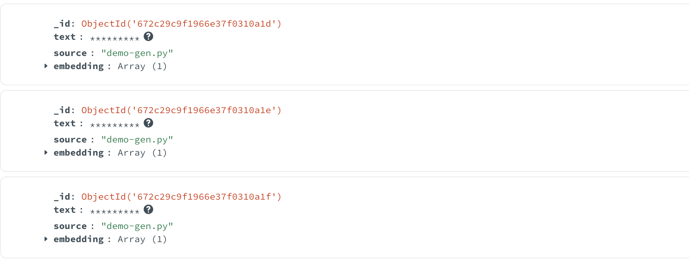

# Chat-with-Encrypted-Collection-of-Notes | Powered by MongoDB

_Inspired by https://github.com/ranfysvalle02/chat-with-docs-mdb_

**Chat-with-Encrypted-Collection-of-Notes** is a secure web application built with Flask that empowers users to upload and manage collections of notes. Users can interact with their notes through an AI chatbot, enabling insightful discussions and explorations of the uploaded content. Leveraging MongoDB Atlas Vector Search and client-side field-level encryption, the application ensures data privacy and security while providing powerful search capabilities.


---

## **Features**

- **Chunk Management**: View, edit, and delete individual text chunks.
- **Chat Chunk Control**: Specify the number of chunks the AI uses during conversations.
- **Ingest Chunk Size Control**: Define the size of text chunks during data ingestion.
- **File Upload and Display**: Upload various text files and display their content.
- **Multiple File Formats Supported**: Supports PDF, `.txt`, `.md`, `.html`, and more.
- **AI-Powered Chat**: Engage in conversations with an AI assistant about your uploaded content.
- **Privacy-Focused**: All processing happens locally—**NOTHING LEAVES YOUR DEVICE**!
- **Dynamic File Management**: Upload new files mid-conversation seamlessly.
- **Data Control**: Clear chat history or all stored data as needed.

---

## **Technologies Used**

- **Flask**: Web framework for building the application.
- **MongoDB Atlas**: Database service with Vector Search capabilities.
- **PyMongo**: Python driver for interacting with MongoDB.
- **LangChain Ollama Embeddings**: For generating text embeddings used in vector searches.
- **Client-Side Field-Level Encryption (CSFLE)**: Ensures that sensitive data remains encrypted at rest.
- **Ollama Llama 3.2 Model**: Locally running AI model for generating responses.

---

## **Security and Privacy**

Ensuring the privacy and security of your data is paramount. This application uses **Client-Side Field-Level Encryption (CSFLE)** to encrypt sensitive fields before storing them in MongoDB. This means:

- **Data Encryption at Rest**: Your notes are encrypted before they reach the database, ensuring that even if the database is compromised, your data remains secure.
- **Local Processing**: All encryption and AI processing happen locally on your device. No sensitive data is transmitted to external servers.
- **Master Key Management**: The application uses a consistent master key stored securely to encrypt and decrypt data.

---

## **How It Works**

1. **File Upload**: Users can upload various text-based files. The application parses these files and splits the content into manageable chunks based on user-defined sizes.
2. **Data Encryption**: Before storing, each text chunk is manually encrypted using the master key via MongoDB's ClientEncryption API.
3. **Embedding Generation**: For each chunk, embeddings are generated using the Ollama Llama 3.2 model. These embeddings facilitate efficient vector-based searches.
4. **Vector Indexing**: Encrypted embeddings are stored in MongoDB Atlas, which indexes them using Vector Search, enabling quick similarity searches.
5. **AI Chat Interaction**: Users can chat with the AI assistant, which retrieves relevant chunks based on the conversation context, decrypts them, and generates meaningful responses.

---

## **Setup and Installation**

### **Prerequisites**

- **Python 3.10+**: Ensure you have Python installed.
- **MongoDB Atlas Account**: Set up a MongoDB Atlas cluster with Vector Search enabled.
- **Ollama Llama 3.2 Model**: Ensure the Ollama model is running locally.

### **Installation Steps**

1. **Clone the Repository**

   ```bash
   git clone https://github.com/yourusername/chat-with-encrypted-collection-of-notes.git
   cd chat-with-encrypted-collection-of-notes
   ```

2. **Create a Virtual Environment**

   ```bash
   python3 -m venv venv
   source venv/bin/activate
   ```

3. **Install Dependencies**

   ```bash
   pip install -r requirements.txt
   ```

4. **Set Up the Master Key**

   The application uses a master key for encryption. This key must be consistent across sessions to decrypt data correctly.

   - **Generate a Master Key**

     ```python
     import os
     print(os.urandom(96).hex())
     ```

   - **Store the Key Securely**

     Save the generated key in a file named `master_key.key` in the project directory.

     ```bash
     echo "your-192-character-hexadecimal-string" > master_key.key
     ```

5. **Configure Environment Variables**

   Set the `SECRET_KEY` for Flask and ensure the `master_key.key` is in place.

   ```bash
   export SECRET_KEY="your-flask-secret-key"
   ```

6. **Run the Application**

   ```bash
   python app.py
   ```

   Access the application by navigating to `http://localhost:5000` in your web browser.

---

## **Key Components and Code Overview**

### **1. Encryption Setup**

The application uses MongoDB's Client-Side Field-Level Encryption (CSFLE) to encrypt sensitive data fields before storing them in the database.

```python
# Initialize the local master key
KEY_FILE = 'master_key.key'

# Check if the key file exists
if os.path.exists(KEY_FILE):
    # If the key file exists, read the key
    with open(KEY_FILE, 'rb') as key_file:
        local_master_key = key_file.read()
else:
    # If the key file does not exist, generate a new key
    local_master_key = os.urandom(96)
    # Write the new key to the key file
    with open(KEY_FILE, 'wb') as key_file:
        key_file.write(local_master_key)

kms_providers = {"local": {"key": local_master_key}}
key_vault_namespace = "encryption.__pymongoTestKeyVault"

# Initialize the key vault client
key_vault_client = MongoClient('mongodb://localhost/?directConnection=true')

# Initialize the main MongoClient without automatic encryption
client = MongoClient('mongodb://localhost/?directConnection=true')
db = client[DATABASE_NAME]

# Initialize ClientEncryption
client_encryption = ClientEncryption(
    kms_providers,
    key_vault_namespace,
    key_vault_client,
    CodecOptions(uuid_representation=STANDARD)
)
```

### **2. Data Ingestion and Encryption**

When a user uploads a file, its content is split into chunks, each chunk is encrypted, and embeddings are generated for vector search.

```python
@app.route('/ingest', methods=['POST'])
def ingest():
    text = str(request.json.get('text'))
    collection_name = str(request.json.get('collection_name'))
    source = str(request.json.get('source'))
    chunk_size = request.json.get('chunk_size', CHUNK_SIZE)

    # Retrieve the key alt name
    keymap_entry = db["keymap"].find_one({"collection": collection_name})
    if not keymap_entry:
        return jsonify({'error': 'Encryption key not found for the collection'}), 500

    key_alt_name = keymap_entry['alt_key']

    # Initialize the RecursiveCharacterTextSplitter
    text_splitter = RecursiveCharacterTextSplitter(
        chunk_size=chunk_size,
        chunk_overlap=20,
        length_function=len,
        separators=["\n\n", "\n", " ", ""]
    )

    # Split the text into chunks
    chunks = text_splitter.split_text(text)
    new_docs = []
    for chunk in chunks:
        # Manually encrypt the text field
        encrypted_text = client_encryption.encrypt(
            chunk,
            Algorithm.AEAD_AES_256_CBC_HMAC_SHA_512_Deterministic,
            key_alt_name=key_alt_name
        )

        new_doc = {
            "text": encrypted_text,
            "source": source,
            "embedding": embeddings.embed_documents([chunk])[0]
        }
        new_docs.append(new_doc)

    if collection_name not in db.list_collection_names():
        return jsonify({'error': 'Collection does not exist'})
    
    try:
        insertResults = db[collection_name].insert_many(new_docs)
        if len(insertResults.inserted_ids) == len(new_docs):
            return jsonify({'text': text, 'num_documents': len(new_docs)})
        else:
            return jsonify({'error': 'Failed to insert documents'})
    except pymongo.errors.PyMongoError as e:
        print(f"Error inserting documents: {e}")
        return jsonify({'error': 'Failed to insert documents'}), 500
```

### **3. Vector Search and AI Chat Integration**

Users can chat with the AI assistant about their notes. The application performs a vector search to retrieve relevant text chunks, decrypts them, and uses them as context for the AI model.

```python
@app.route('/chat', methods=['POST'])
def chat():
    data = request.json
    user_input = data.get('message', '')
    selected_collection = data.get('collection', '')
    chunk_count = int(str(data.get('chunk_count', CHUNKS_PER_QUERY)))
    print("CHUNK_COUNT: " + str(chunk_count))

    conversation_history = session.get('conversation_history', [])
    conversation_history.append(f"Human: {user_input}")

    if selected_collection not in db.list_collection_names():
        # No vector store
        ai_response = generate_response(f"""
    [user input]
    {user_input}
    [/user input]

    [RESPONSE FORMAT]
        - RESPOND IN PLAINTEXT (EMOJIS ARE ALLOWED). IMPORTANT!
        - RESPOND TO THE [user input].
    """, conversation_history)
        docs = []
    else:
        collection = db[selected_collection]
        # Generate embedding for the query
        query_embedding = embeddings.embed_query(user_input)
        # Query the vector store
        documents = list(collection.aggregate([
            {"$match": {}},
            {"$project": {"_id": 0, "embedding": 0}}
        ], allowDiskUse=True))
        docs = documents
        print("\nQuery Response:")
        print("---------------")
        print(str(docs))
        print("---------------\n")

        # Decrypt the text field in docs
        for doc in docs:
            encrypted_text = doc['text']
            if isinstance(encrypted_text, Binary):
                doc['text'] = client_encryption.decrypt(encrypted_text)

        context_texts = [doc['text'] for doc in docs]

        ai_response = generate_response(f"""
    [context]
    {str(context_texts)}
    [/context]

    USE THE [context] TO RESPOND TO [user_input=`{user_input}`]

    [RESPONSE FORMAT]
        - RESPOND IN PLAINTEXT (EMOJIS ARE ALLOWED). IMPORTANT!
        - USE THE CONTEXT TO RESPOND TO THE [user input].
        - THINK CRITICALLY AND STEP BY STEP. ONLY USE THE CONTEXT TO RESPOND.
        - DO NOT INCLUDE YOUR THOUGHT PROCESS IN YOUR RESPONSE. MAKE SURE YOUR RESPONSE IS COHERENT.
        - THINK CRITICALLY AND STEP BY STEP. ONLY USE THE CONTEXT TO RESPOND.
    [/RESPONSE FORMAT]
    """, conversation_history)

    conversation_history.append(f"AI: {ai_response}")
    session['conversation_history'] = conversation_history

    return jsonify({
        'response': ai_response,
        'full_history': conversation_history,
        'chunks': context_texts if docs else []
    })
```

---

## **Lessons Learned**

### **1. Importance of Consistent Key Management**

One of the critical challenges faced was the **HMAC validation failure**, which occurred due to inconsistent master keys used for encryption and decryption. Ensuring that the `local_master_key` remains the same across all sessions was paramount. This was achieved by storing the master key in a persistent file (`master_key.key`) rather than generating a new one each time the application runs.

### **2. Manual Encryption Over Automatic Encryption**

While MongoDB's automatic encryption is convenient, it posed significant challenges when combined with aggregation operations, leading to errors and complex configurations. Switching to **manual encryption** provided greater control, flexibility, and compatibility with complex database queries, such as vector searches and aggregations.

### **3. Correct Configuration of Vector Searches**

Integrating MongoDB Atlas Vector Search required precise configuration of the `$vectorSearch` operator. Initial mistakes in parameter names (e.g., using `path` instead of `vectorField` or `k` instead of `limit`) led to errors. Carefully following MongoDB's documentation and ensuring parameter accuracy was essential for successful vector searches.

### **4. Robust Error Handling**

Implementing comprehensive error handling helped in diagnosing and resolving issues effectively. Wrapping critical operations in try-except blocks and providing meaningful error messages facilitated smoother debugging and enhanced application reliability.

### **5. Testing and Validation**

Regular testing at each development stage ensured that components worked as intended before integration. Validating embedding dimensions, encryption/decryption processes, and vector search results helped maintain data integrity and application performance.

---

## **Educational Insights and Best Practices**

### **1. Ensuring Data Security with CSFLE**

Implementing Client-Side Field-Level Encryption (CSFLE) is a robust method to protect sensitive data. By encrypting data before it reaches the database, you ensure that even if the database is compromised, the data remains secure.

**Best Practices:**

- **Consistent Master Key Management**: Store your master key securely and ensure it's consistently used across all application instances.
- **Avoid Regenerating Keys**: Changing the master key without re-encrypting existing data leads to decryption failures.
- **Secure Storage of Master Keys**: Use environment variables or secure storage solutions like AWS KMS, Azure Key Vault, or HashiCorp Vault in production environments.

### **2. Manual vs. Automatic Encryption**

While automatic encryption simplifies the encryption process, it can introduce complexities, especially with advanced database operations like aggregations and vector searches.

**Advantages of Manual Encryption:**

- **Greater Control**: Decide exactly which fields to encrypt and when.
- **Flexibility**: Seamlessly integrate with complex database queries and operations.
- **Simplified Configuration**: Avoid managing encrypted fields maps and client re-initializations.

### **3. Configuring Vector Searches Correctly**

Vector searches are powerful for semantic similarity searches but require precise configuration to function correctly.

**Key Points:**

- **Correct Parameter Names**: Ensure that all required parameters (`index`, `queryVector`, `vectorField`, `limit`, etc.) are correctly named and set.
- **Embedding Consistency**: The dimensionality of your query embeddings must match the vector field's configuration in MongoDB.
- **Index Readiness**: Always verify that your vector index is fully built and queryable before performing searches.

### **4. Robust Error Handling**

Implement comprehensive error handling to catch and resolve issues promptly. This includes:

- **Try-Except Blocks**: Wrap critical operations in try-except blocks to handle exceptions gracefully.
- **Meaningful Error Messages**: Provide clear and descriptive error messages to aid in debugging.
- **Logging**: Implement logging to trace application flow and capture errors for analysis.

### **5. Testing and Validation**

Regularly test each component of your application to ensure they work as expected before integrating them. Validate:

- **Encryption and Decryption**: Ensure that data is correctly encrypted before storage and decrypted upon retrieval.
- **Vector Search Results**: Confirm that vector searches return relevant and accurate results based on the embeddings.
- **AI Responses**: Validate that the AI chatbot generates coherent and contextually relevant responses.

---

---

## **Full Code**

Here is the **working code** for reference:

```python
import time
import os
import uuid
import requests
from flask import Flask, request, render_template, jsonify, session
from pymongo import MongoClient
import pymongo
from pymongo.operations import SearchIndexModel
from pymongo.errors import ServerSelectionTimeoutError
from langchain_ollama import OllamaEmbeddings
from langchain.text_splitter import RecursiveCharacterTextSplitter
from pymongo.encryption import ClientEncryption, Algorithm
from bson.codec_options import CodecOptions
from bson.binary import Binary, STANDARD

app = Flask(__name__)

embeddings = OllamaEmbeddings(
    model="nomic-embed-text",
)
CHUNK_SIZE = 2000
CHUNKS_PER_QUERY = 5
DATABASE_NAME = 'mydatabase'

KEY_FILE = 'master_key.key'

# Check if the key file exists
if os.path.exists(KEY_FILE):
    # If the key file exists, read the key
    with open(KEY_FILE, 'rb') as key_file:
        local_master_key = key_file.read()
else:
    # If the key file does not exist, generate a new key
    local_master_key = os.urandom(96)
    # Write the new key to the key file
    with open(KEY_FILE, 'wb') as key_file:
        key_file.write(local_master_key)

kms_providers = {"local": {"key": local_master_key}}
key_vault_namespace = "encryption.__pymongoTestKeyVault"

# Initialize the key vault client
key_vault_client = MongoClient('mongodb://localhost/?directConnection=true')

# Initialize the main MongoClient without automatic encryption
client = MongoClient('mongodb://localhost/?directConnection=true')
db = client[DATABASE_NAME]

# Initialize ClientEncryption
try:
    client_encryption = ClientEncryption(
        kms_providers,
        key_vault_namespace,
        key_vault_client,
        CodecOptions(uuid_representation=STANDARD)
    )
except pymongo.errors.EncryptionError as e:
    # Handle encryption errors gracefully
    print(f"Error creating ClientEncryption: {e}")

if client is None or db is None:
    raise Exception(f"Failed to connect to MongoDB - Check your configuration. client={client} db={db}")

# Define function to summarize each chunk
def summarize(txt):
    url = 'http://localhost:11434/v1/completions'
    headers = {'Content-Type': 'application/json'}
    full_prompt = f"""
[INST]
<<SYS>>
You are a helpful AI assistant who summarizes context and generates excellent questions.
<</SYS>>

[context to summarize]
{str(txt)}
[/context to summarize]

Summarize the context. Provide the summary, and some helpful questions that can be answered from the context.

[RESPONSE FORMAT]
- RESPOND IN PLAINTEXT (EMOJIS ARE ALLOWED). IMPORTANT!
- USE MARKDOWN LIST FORMAT.
- MAX RESPONSE LENGTH IS 1000 WORDS.
[/RESPONSE FORMAT]
[/INST]
"""
    data = {'prompt': full_prompt, 'model': 'llama3.2:3b', 'max_tokens': 5000}
    try:
        response = requests.post(url, headers=headers, json=data)
        response.raise_for_status()
        return response.json()['choices'][0]['text']
    except requests.RequestException as e:
        return f"Error: {e}"

def get_collection_names():
    """Retrieve the names of all collections in the database."""
    collections = list(db.list_collection_names())
    app.logger.debug(f"Collections: {collections}")
    return collections

def generate_response(prompt, conversation_history):
    """Generate an AI response based on the prompt and conversation history."""
    formatted_history = "\n".join(conversation_history)
    full_prompt = f"""
[INST]
<<SYS>>
You are a helpful AI assistant.
<</SYS>>

[chat history]
{formatted_history}
[/chat history]

{prompt}
[/INST]
"""
    print("PROMPT: " + full_prompt)
    url = 'http://localhost:11434/v1/completions'
    headers = {'Content-Type': 'application/json'}
    data = {'prompt': full_prompt, 'model': 'llama3.2:3b', 'max_tokens': 5000}

    try:
        response = requests.post(url, headers=headers, json=data)
        response.raise_for_status()
        return response.json()['choices'][0]['text']
    except requests.RequestException as e:
        return f"Error: {e}"

@app.route('/status')
def get_mongo_status():
    """Microservice health check"""
    try:
        temp_client = MongoClient('mongodb://localhost/?directConnection=true', serverSelectionTimeoutMS=5000)
        temp_client.server_info()
        return jsonify({"database_status": "🟢"})
    except pymongo.errors.ServerSelectionTimeoutError:
        return jsonify({"database_status": "🔴"}), 503

@app.route('/')
def index():
    return render_template('index.html', collections=get_collection_names())

@app.route('/ingest', methods=['POST'])
def ingest():
    text = str(request.json.get('text'))
    collection_name = str(request.json.get('collection_name'))
    source = str(request.json.get('source'))
    chunk_size = request.json.get('chunk_size', CHUNK_SIZE)

    # Retrieve the key alt name
    keymap_entry = db["keymap"].find_one({"collection": collection_name})
    if not keymap_entry:
        return jsonify({'error': 'Encryption key not found for the collection'}), 500

    key_alt_name = keymap_entry['alt_key']

    # Initialize the RecursiveCharacterTextSplitter
    text_splitter = RecursiveCharacterTextSplitter(
        chunk_size=chunk_size,
        chunk_overlap=20,
        length_function=len,
        separators=["\n\n", "\n", " ", ""]
    )

    # Split the text into chunks
    chunks = text_splitter.split_text(text)
    new_docs = []
    for chunk in chunks:
        # Manually encrypt the text field
        encrypted_text = client_encryption.encrypt(
            chunk,
            Algorithm.AEAD_AES_256_CBC_HMAC_SHA_512_Deterministic,
            key_alt_name=key_alt_name
        )

        new_doc = {
            "text": encrypted_text,
            "source": source,
            "embedding": embeddings.embed_documents([chunk])
        }
        new_docs.append(new_doc)

    if collection_name not in db.list_collection_names():
        return jsonify({'error': 'Collection does not exist'})

    try:
        insertResults = db[collection_name].insert_many(new_docs)
        if len(insertResults.inserted_ids) == len(new_docs):
            return jsonify({'text': text, 'num_documents': len(new_docs)})
        else:
            return jsonify({'error': 'Failed to insert documents'})
    except pymongo.errors.PyMongoError as e:
        print(f"Error inserting documents: {e}")
        return jsonify({'error': 'Failed to insert documents'}), 500

@app.route('/create_collection', methods=['POST'])
def create_collection():
    new_collection_name = request.json.get('name')
    if new_collection_name in db.list_collection_names():
        return jsonify({'error': 'Collection already exists'})

    alt_name = str(uuid.uuid4().hex)
    key_id = client_encryption.create_data_key("local", key_alt_names=[alt_name])

    # Create the collection
    db.create_collection(new_collection_name)

    # Create the keymap collection if it doesn't exist
    if "keymap" not in db.list_collection_names():
        db.create_collection("keymap")

    # Store the key alt name in your keymap collection
    db["keymap"].insert_one({
        "collection": new_collection_name,
        "alt_key": alt_name
    })

    # Create your index model, then create the search index
    search_index_model = SearchIndexModel(
        definition={
            "fields": [
                {
                    "type": "vector",
                    "path": "embedding",
                    "numDimensions": 768,
                    "similarity": "cosine"
                }
            ]
        },
        name="vector_index",
        type="vectorSearch",
    )
    result = db[new_collection_name].create_search_index(model=search_index_model)
    print("New search index named " + result + " is building.")
    # Wait for initial sync to complete
    print("Polling to check if the index is ready. This may take up to a minute.")
    predicate = lambda index: index.get("queryable") is True
    while True:
        indices = list(db[new_collection_name].list_search_indexes("vector_index"))
        if len(indices) and predicate(indices[0]):
            break
        time.sleep(5)
    print(result + " is ready for querying.")
    return jsonify({'status': 'success', 'collections': get_collection_names()})

@app.route('/list_collections', methods=['GET'])
def get_collections():
    collections = get_collection_names()
    return jsonify({'collections': collections})

@app.route('/delete_collection', methods=['POST'])
def delete_collection():
    collection_name = request.json.get('name')
    if collection_name not in db.list_collection_names():
        return jsonify({'error': 'Collection does not exist'})
    db.drop_collection(collection_name)
    return jsonify({'status': 'success', 'collections': get_collection_names()})

@app.route('/explore', methods=['GET'])
def explore():
    collection_name = request.args.get('collection')
    if collection_name not in db.list_collection_names():
        return jsonify({'error': 'Collection does not exist'})
    collection = db[collection_name]
    try:
        documents = list(collection.aggregate([
            {"$match": {}},
            {"$project": {"_id": 0, "embedding": 0}}
        ], allowDiskUse=True))

        # Manually decrypt the 'text' field
        for doc in documents:
            encrypted_text = doc['text']
            if isinstance(encrypted_text, Binary):
                doc['text'] = client_encryption.decrypt(encrypted_text)

        documents_summary = list(collection.aggregate([
            {
                '$group': {
                    '_id': '$source',
                    'texts': {
                        '$push': '$text'
                    }
                }
            },
            {
                '$project': {
                    'texts': {
                        '$slice': ['$texts', 5]
                    }
                }
            }
        ], allowDiskUse=True))

        # Manually decrypt texts in documents_summary
        for summary in documents_summary:
            decrypted_texts = []
            for text in summary['texts']:
                if isinstance(text, Binary):
                    decrypted_texts.append(client_encryption.decrypt(text))
                else:
                    decrypted_texts.append(text)
            summary['texts'] = decrypted_texts

        return jsonify({'documents': documents, 'summary': summarize(str(documents_summary))})
    except pymongo.errors.PyMongoError as e:
        print(f"Error exploring collection: {e}")
        return jsonify({'error': 'Failed to explore collection'}), 500

@app.route('/update_chunk', methods=['POST'])
def update_chunk():
    action = request.json.get('action')
    collection_name = request.json.get('collection')
    source = request.json.get('source')
    og_text = request.json.get('og_text')
    new_text = request.json.get('new_text')

    if collection_name not in db.list_collection_names():
        return jsonify({'error': 'Collection does not exist'})

    collection = db[collection_name]

    # Retrieve the key alt name
    keymap_entry = db["keymap"].find_one({"collection": collection_name})
    if not keymap_entry:
        return jsonify({'error': 'Encryption key not found for the collection'}), 500

    key_alt_name = keymap_entry['alt_key']

    if action == 'save':
        # Get new embeddings
        new_embedding = embeddings.embed_documents([new_text])

        # Encrypt the new text and original text
        encrypted_new_text = client_encryption.encrypt(
            new_text,
            Algorithm.AEAD_AES_256_CBC_HMAC_SHA_512_Deterministic,
            key_alt_name=key_alt_name
        )
        encrypted_og_text = client_encryption.encrypt(
            og_text,
            Algorithm.AEAD_AES_256_CBC_HMAC_SHA_512_Deterministic,
            key_alt_name=key_alt_name
        )

        # Update the document
        try:
            collection.update_many(
                {'source': source, 'text': encrypted_og_text},
                {'$set': {'text': encrypted_new_text, 'embedding': new_embedding}}
            )
        except pymongo.errors.PyMongoError as e:
            print(f"Error updating document: {e}")
            return jsonify({'error': 'Failed to update document'}), 500

    elif action == 'delete':
        # Encrypt the original text
        encrypted_og_text = client_encryption.encrypt(
            og_text,
            Algorithm.AEAD_AES_256_CBC_HMAC_SHA_512_Deterministic,
            key_alt_name=key_alt_name
        )
        try:
            collection.delete_many({'source': source, 'text': encrypted_og_text})
        except pymongo.errors.PyMongoError as e:
            print(f"Error deleting document: {e}")
            return jsonify({'error': 'Failed to delete document'}), 500

    return jsonify({'og_text': og_text, 'new_text': new_text})

@app.route('/chat', methods=['POST'])
def chat():
    data = request.json
    user_input = data.get('message', '')
    selected_collection = data.get('collection', '')
    chunk_count = int(str(data.get('chunk_count', CHUNKS_PER_QUERY)))
    print("CHUNK_COUNT: " + str(chunk_count))

    conversation_history = session.get('conversation_history', [])
    conversation_history.append(f"Human: {user_input}")

    if selected_collection not in db.list_collection_names():
        # No vector store
        ai_response = generate_response(f"""
    [user input]
    {user_input}
    [/user input]

    [RESPONSE FORMAT]
        - RESPOND IN PLAINTEXT (EMOJIS ARE ALLOWED). IMPORTANT!
        - RESPOND TO THE [user input].
    """, conversation_history)
        docs = []
    else:
        collection = db[selected_collection]
        # Generate embedding for the query
        query_embedding = embeddings.embed_query(user_input)
        # Query the vector store
        documents = list(collection.aggregate([
            {"$match": {}},
            {"$project": {"_id": 0, "embedding": 0}}
        ], allowDiskUse=True))
        docs = documents
        print("\nQuery Response:")
        print("---------------")
        print(str(docs))
        print("---------------\n")

        # Decrypt the text field in docs
        for doc in docs:
            encrypted_text = doc['text']
            if isinstance(encrypted_text, Binary):
                doc['text'] = client_encryption.decrypt(encrypted_text)

        context_texts = [doc['text'] for doc in docs]

        ai_response = generate_response(f"""
    [context]
    {str(context_texts)}
    [/context]

    USE THE [context] TO RESPOND TO [user_input=`{user_input}`]

    [RESPONSE FORMAT]
        - RESPOND IN PLAINTEXT (EMOJIS ARE ALLOWED). IMPORTANT!
        - USE THE CONTEXT TO RESPOND TO THE [user input].
        - THINK CRITICALLY AND STEP BY STEP. ONLY USE THE CONTEXT TO RESPOND.
        - DO NOT INCLUDE YOUR THOUGHT PROCESS IN YOUR RESPONSE. MAKE SURE YOUR RESPONSE IS COHERENT.
        - THINK CRITICALLY AND STEP BY STEP. ONLY USE THE CONTEXT TO RESPOND.
    [/RESPONSE FORMAT]
    """, conversation_history)

    conversation_history.append(f"AI: {ai_response}")
    session['conversation_history'] = conversation_history

    return jsonify({
        'response': ai_response,
        'full_history': conversation_history,
        'chunks': context_texts if docs else []
    })


@app.route('/clear_chat', methods=['POST'])
def clear_chat():
    session['conversation_history'] = []
    return jsonify({'status': 'success', 'message': 'Chat history cleared'})

@app.route('/clear_all', methods=['POST'])
def clear_all():
    session.clear()
    return jsonify({'status': 'success', 'message': 'All data cleared'})

@app.route('/show_session', methods=['GET'])
def show_session():
    return jsonify(dict(session))

if __name__ == "__main__":
    app.run(debug=True)

```
